# High Availability Web App Deployment on AWS

## 🎯 Goal
Deploy a highly available and secure web application architecture using:
- ECS Fargate (compute layer)
- RDS (database in private subnet)
- Application Load Balancer (HTTPS via ACM)

---

## 🏗️ Architecture

```mermaid
flowchart TD
    User([👤 User]) --> Route53[Route 53]

    Route53 --> ALB[Application Load Balancer\nHTTPS via ACM]
    
    subgraph VPC["VPC: ha-webapp-vpc 10.0.0.0/16"]
        
        subgraph Public["Public Subnets - ALB"]
            ALB --- SG_ALB[SG: ha-webapp-sg-alb\nInbound: 80/443 from 0.0.0.0/0]
        end

        subgraph Private["Private Subnets - ECS + RDS"]
            ALB --> ECS1[ECS Fargate Task\nnginx container]
            ALB --> ECS2[ECS Fargate Task\nnginx container]
            
            ECS1 --- SG_ECS[SG: ha-webapp-sg-ecs\nInbound: 80 from ALB]
            ECS2 --- SG_ECS
            
            ECS1 --> RDS[(RDS PostgreSQL\ndb.t4g.micro, private subnet)]
            ECS2 --> RDS

            RDS --- SG_RDS[SG: ha-webapp-sg-rds-c\nInbound: 5432 from ECS SG]
        end
    end
```

➡️ For the full step-by-step build process with screenshots, see the [Build Guide](./docs/BUILD.md).

---

## ⚙️ Services Used
- ECS Fargate (2 tasks across 2 AZs)
- Application Load Balancer (HTTPS termination)
- Amazon RDS (Postgres, Multi-AZ optional)
- VPC with public and private subnets

---

## 🔒 Security
- RDS only accessible from ECS tasks (private subnet)
- Security Groups with least privilege
- IAM Role for ECS Task Execution

---

## 📊 Monitoring
- CloudWatch Logs (ECS and RDS)
- CloudWatch Alarm for ALB 5XX error rate

---

## 💰 Cost Estimation
- ECS Fargate: ~$15–20/month
- ALB: ~$16/month
- RDS: ~$15/month (Free Tier possible)
- Route 53: $0.50/month + domain
