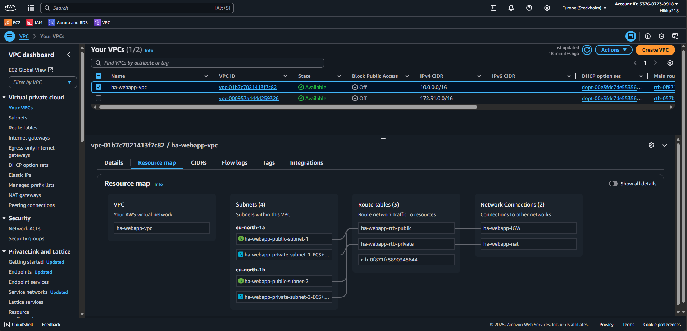
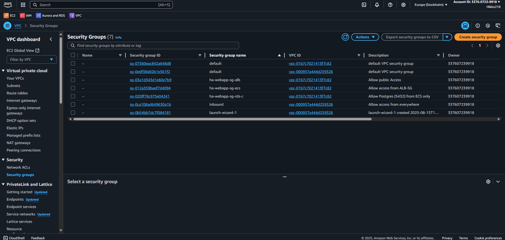
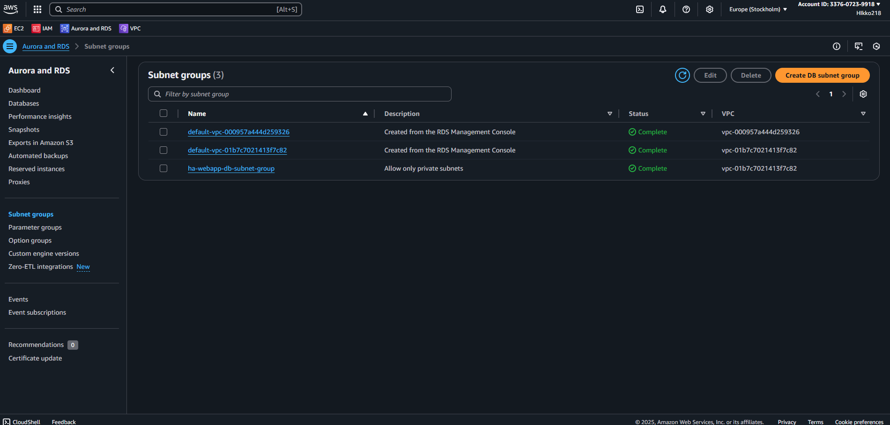
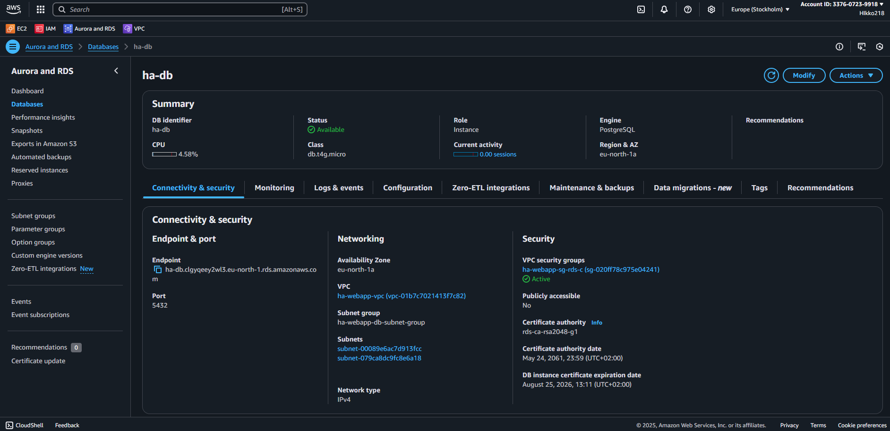

# High Availability Web App – Build Guide

## ⚙️ Step 1 – Create VPC

---

## ⚙️ Step 2 – Security Settings

### Security Groups

| Security Group       | Inbound Rules             | Source                 | Outbound Rules  | Description                          |
|----------------------|---------------------------|------------------------|-----------------|--------------------------------------|
| ha-webapp-sg-alb     | 80, 443                   | 0.0.0.0/0              | All traffic     | Allow public HTTP/HTTPS inbound      |
| ha-webapp-sg-ecs     | 80                        | ha-webapp-sg-alb       | All traffic     | Allow traffic from ALB only          |
| ha-webapp-sg-rds-c   | 5432 (Postgres)           | ha-webapp-sg-ecs       | All traffic     | Allow Postgres from ECS only         |

### DB Subnet Group
- Name: ha-webapp-db-subnet-group
- Subnets: private subnets across 2 AZs

...

## ⚙️ Step 3 – Create RDS Database

### RDS Setup
- **Engine:** PostgreSQL
- **Instance class:** db.t4g.micro (Free Tier eligible)
- **Subnet Group:** ha-webapp-db-subnet-group (private subnets only)
- **Public Access:** Disabled
- **Security Group:** ha-webapp-sg-rds-c (allows inbound Postgres 5432 only from ECS SG)
- **High Availability:** Single-AZ (cost optimization for demo). In production, this would be Multi-AZ for high availability.

...

