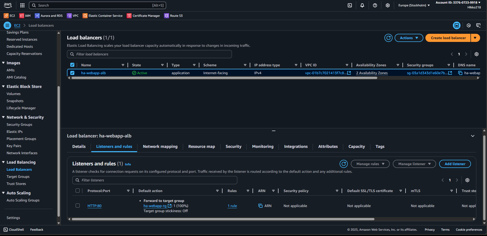

# High Availability Web App – Build Guide

## ⚙️ Step 1 – Create VPC

---

## ⚙️ Step 2 – Security Settings

### Security Groups

| Security Group       | Inbound Rules             | Source                 | Outbound Rules  | Description                          |
|----------------------|---------------------------|------------------------|-----------------|--------------------------------------|
| ha-webapp-sg-alb     | 80, 443                   | 0.0.0.0/0              | All traffic     | Allow public HTTP/HTTPS inbound      |
| ha-webapp-sg-ecs     | 80                        | ha-webapp-sg-alb       | All traffic     | Allow traffic from ALB only          |
| ha-webapp-sg-rds-c   | 5432 (Postgres)           | ha-webapp-sg-ecs       | All traffic     | Allow Postgres from ECS only         |

### DB Subnet Group
- Name: ha-webapp-db-subnet-group
- Subnets: private subnets across 2 AZs

---

## ⚙️ Step 3 – Create RDS Database

### RDS Setup
- **Engine:** PostgreSQL
- **Instance class:** db.t4g.micro (Free Tier eligible)
- **Subnet Group:** ha-webapp-db-subnet-group (private subnets only)
- **Public Access:** Disabled
- **Security Group:** ha-webapp-sg-rds-c (allows inbound Postgres 5432 only from ECS SG)
- **High Availability:** Single-AZ (cost optimization for demo). In production, this would be Multi-AZ for high availability.

---

## ⚙️ Step 4 – ECS Fargate (Compute Layer)

ECS Cluster with Fargate Tasks running `nginx:latest` across **2 Availability Zones**.

### ECS Setup
- **Cluster:** `ha-webapp-cluster`
- **Task Definition:** `ha-webapp-task` (Fargate, 0.25 vCPU, 512 MB Memory)
- **Service:** `ha-nginx-service` (2 tasks, spread across AZs)
- **Logging:** CloudWatch enabled
- **Security Group:** `ha-webapp-sg-ecs` (inbound from ALB only)

### Screenshots

  
  
  

---

## ⚙️ Step 5 - Application Load Balancer (ALB)

The ALB provides a public entry point into the VPC and securely forwards traffic to ECS tasks in private subnets.

### ALB Setup
- **Type:** Application Load Balancer (`ha-webapp-alb`)
- **Scheme:** Internet-facing (public entry point)
- **VPC:** `ha-webapp-vpc`
- **Subnets:** Public subnets across 2 AZs
- **Security Group:** `ha-webapp-sg-alb` (ports 80/443 open)
- **Listener:** HTTP :80 → forwards to Target Group
- **Target Group:** `ha-webapp-tg` (IP-based, HTTP :80, health check = `/`)
- ⚠️ Targets are registered automatically by the ECS service (do not add IPs manually)

### Screenshots

  
  
  

---

## ⚙️ Step 6 - Monitoring (CloudWatch)

CloudWatch is used to monitor system health and react to anomalies.

### Setup
- **Dashboard:** Displays key metrics such as  
  - ECS CPU Utilization  
  - RDS CPU Utilization  
  - ALB Request Count  
- **Alarm:** Triggers an SNS notification if ECS CPU > 70% (demo setup).

### Screenshots

  
  

---

## ⚙️ Step 7 - Billing and Cost Management

AWS Billing provides transparency into service costs.  
Even in demo setups, it’s important to track cost drivers (RDS, ECS, ALB, CloudWatch).

### Setup
- **Cost Explorer / Billing Dashboard**: Shows monthly spend and forecasts.
- **Breakdown by Service**: Helps identify the most expensive components.
- **Budget Alerts (optional)**: Set thresholds to avoid unexpected charges.

💰 **Current Demo Costs:**  
Running this setup continuously results in approx. **$40–50/month**, mostly driven by RDS and ECS.

### Screenshots

