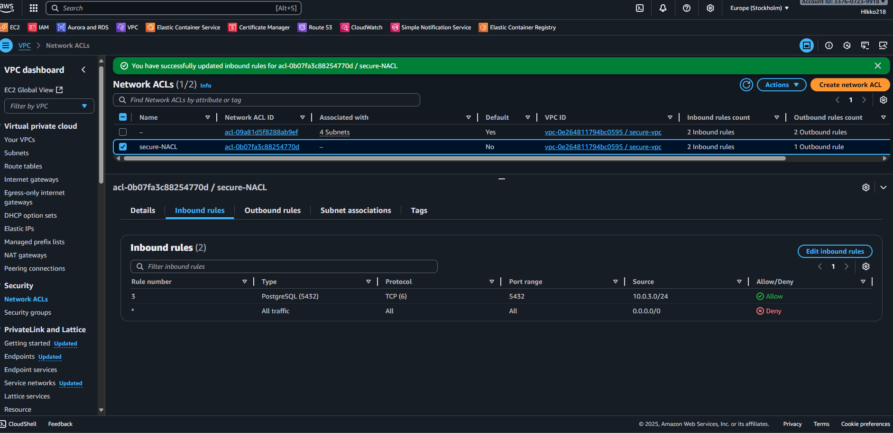
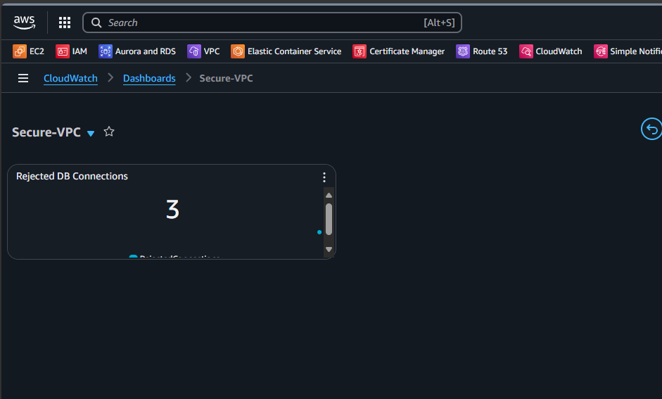

# Secure VPC – Build Guide

## ⚙️ Step 1 – Create VPC
VPC with public + private subnets, NAT Gateway, Internet Gateway, and S3 Gateway Endpoint.

---

## ⚙️ Step 2 – Secure Access with Session Manager
Instead of exposing SSH ports, EC2 in private subnets are accessed via **AWS Systems Manager Session Manager**.  
This eliminates the need for bastion hosts or key pairs.

### Security Groups
| Security Group | Inbound Rules | Outbound Rules | Description |
|----------------|--------------|----------------|-------------|
| secure-ec2-sg  | None          | All traffic    | EC2 instance (no inbound, outbound all) |
| secure-rds-sg  | 3306 from EC2 SG | All traffic | RDS instance, only accessible from EC2 |

📸 *No inbound rules on EC2 Security Group*  

### Session Manager
📸 *EC2 accessed via Session Manager – no public IP, no SSH*  

---

## ⚙️ Step 3 – Create RDS Database
- **Engine:** MySQL (demo)  
- **Instance class:** db.t3.micro (Free Tier eligible)  
- **Subnet Group:** secure-db-subnet-group (private subnets only)  
- **Public Access:** Disabled  
- **Security Group:** secure-rds-sg (inbound 3306 only from EC2 SG)  

---

## ⚙️ Step 4 - Network ACLs (NACLs)

NACLs act as an additional, subnet-level firewall. They are **stateless**, so you must configure both inbound and outbound rules.  
In this project, the NACL restricts traffic to the database subnet to **only the required port (5432)**.

| Rule # | Direction | Protocol | Port Range | Source/Destination | Action | Description |
|--------|-----------|----------|-------------|-------------------|--------|-------------|
| 100    | Inbound   | TCP      | 5432        | 10.0.3.0/24       | ALLOW  | Allow Postgres traffic from EC2 subnet |
| *      | Inbound   | ALL      | ALL         | 0.0.0.0/0         | DENY   | Deny all other inbound traffic |
| 100    | Outbound  | TCP      | 1024-65535  | 10.0.3.0/24       | ALLOW  | Allow response traffic to EC2 subnet |
| *      | Outbound  | ALL      | ALL         | 0.0.0.0/0         | DENY   | Deny all other outbound traffic |

## ⚙️ Step 5 – Monitoring (CloudWatch & VPC Flow Logs)
Created CloudWatch metric filter RejectedConnections from Flow Logs → visualized in Dashboard

---

## ⚙️ Step 6 – Billing and Cost Management
Even small demo setups incur AWS costs. At the time of writing, the AWS Billing Dashboard still shows `0` (resources have just been created).  
Based on AWS on-demand pricing, expected monthly costs are:

| Service        | Estimated Cost | Notes |
|----------------|----------------|-------|
| NAT Gateway    | ~$32 / month   | Main cost driver (hourly + data transfer) |
| RDS (db.t3.micro) | ~$15–20 / month | Free Tier covers storage for first 12 months |
| EC2 (t3.micro) | ~$8 / month    | Free Tier eligible |
| CloudWatch Logs & Metrics | ~$1–2 / month | Depends on log volume |
| S3 Gateway Endpoint | Free | Eliminates NAT data costs for S3 |

💡 Note: For production setups, a NAT Gateway should be deployed in each AZ for high availability.  
This demo uses only 1 NAT Gateway (~$32/month) to optimize costs, while production would require 2 NAT Gateways (~$64/month).

---

