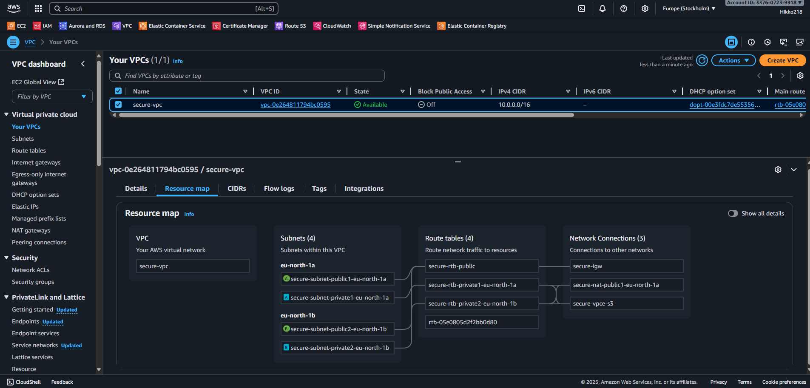
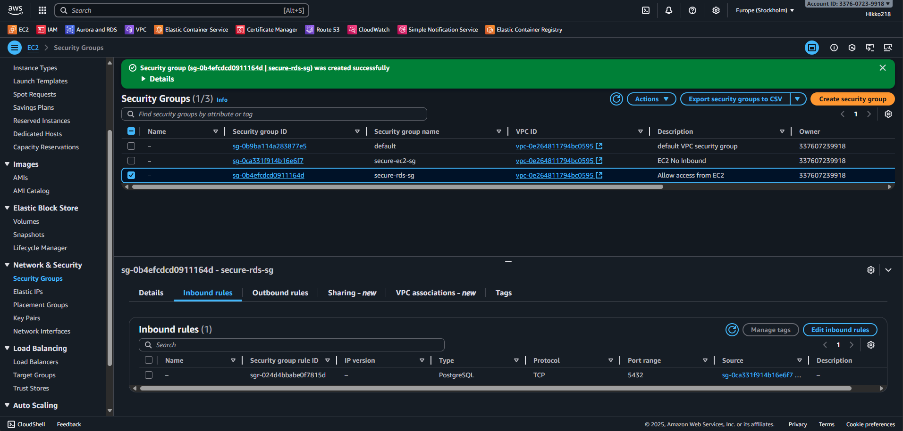
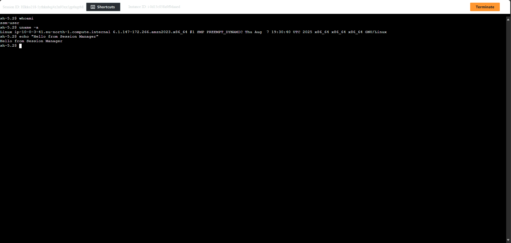
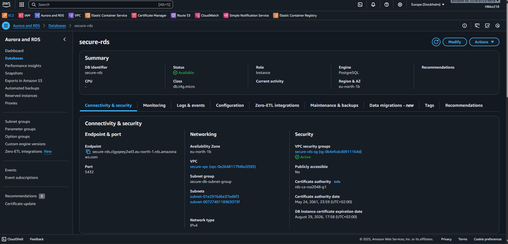

# Secure VPC – Build Guide

## ⚙️ Step 1 – Create VPC
VPC with public + private subnets, NAT Gateway, Internet Gateway, and S3 Gateway Endpoint.

---

## ⚙️ Step 2 – Secure Access with Session Manager
Instead of exposing SSH ports, EC2 in private subnets are accessed via **AWS Systems Manager Session Manager**.  
This eliminates the need for bastion hosts or key pairs.

### Security Groups
| Security Group | Inbound Rules | Outbound Rules | Description |
|----------------|--------------|----------------|-------------|
| secure-ec2-sg  | None          | All traffic    | EC2 instance (no inbound, outbound all) |
| secure-rds-sg  | 3306 from EC2 SG | All traffic | RDS instance, only accessible from EC2 |

📸 *No inbound rules on EC2 Security Group*  

### Session Manager
📸 *EC2 accessed via Session Manager – no public IP, no SSH*  

---

## ⚙️ Step 3 – Create RDS Database
- **Engine:** MySQL (demo)  
- **Instance class:** db.t3.micro (Free Tier eligible)  
- **Subnet Group:** secure-db-subnet-group (private subnets only)  
- **Public Access:** Disabled  
- **Security Group:** secure-rds-sg (inbound 3306 only from EC2 SG)  

---

## ⚙️ Step 4 – Monitoring (CloudWatch & VPC Flow Logs)
- **VPC Flow Logs** to CloudWatch Logs (`secure-vpc-logs`)  
- **CloudWatch Alarm** for unusual inbound traffic attempts  
- Optional: send notifications via SNS  

---

## ⚙️ Step 5 – Billing and Cost Management
Even demo setups incur costs. Main drivers here:  
- NAT Gateway (~$32/month)  
- RDS (~$15–20/month, depending on instance type)  
- Flow Logs: a few cents  
- S3 Gateway Endpoint: **free** (saves NAT data transfer costs to S3)

---

