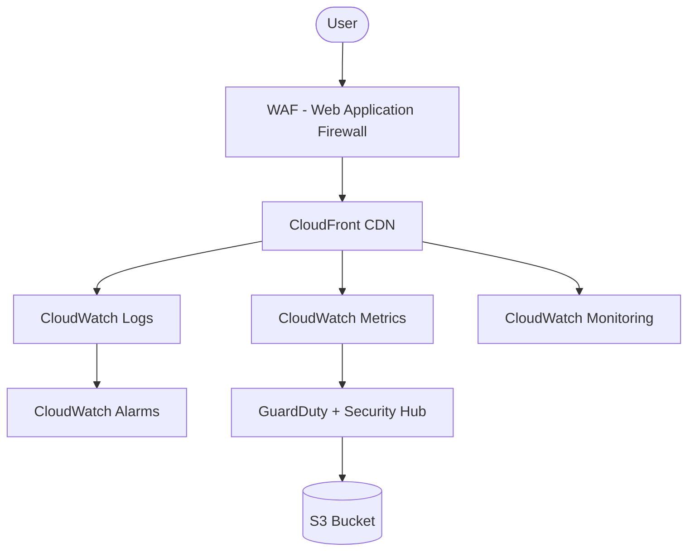

# Cloud Storage & Monitoring

## 🎯 Goal
Set up a secure and monitored cloud storage solution using S3:
- Object versioning and lifecycle policies
- Monitoring and alerts
- Optional CDN with CloudFront

---

## 🏗️ Architecture

➡️ For the full step-by-step build process with screenshots, see the [Build Guide](./docs/BUILD.md).

---

## ⚙️ Services Used
- Amazon S3 (Versioning, Lifecycle → Glacier)
- CloudFront (CDN with HTTPS)
- CloudWatch Dashboard (S3 Access Logs)
- GuardDuty + Security Hub for threat detection

---

## 🔒 Security
- S3 Public Access Block enabled
- Bucket Policy restricted (only via CloudFront OAI)
- Encryption enabled (SSE-S3)

---

## 📊 Monitoring
- CloudWatch Dashboard: GET/PUT request metrics
- CloudWatch Alarm for abnormal request volume
- GuardDuty findings documented

---

## 💰 Cost Estimation
- S3: <$1/month
- CloudFront: ~$1–2/month (depends on traffic)
- CloudWatch: minimal
