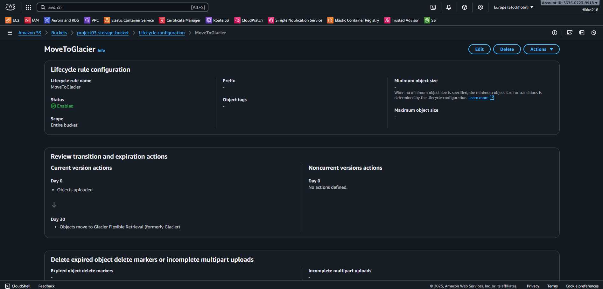
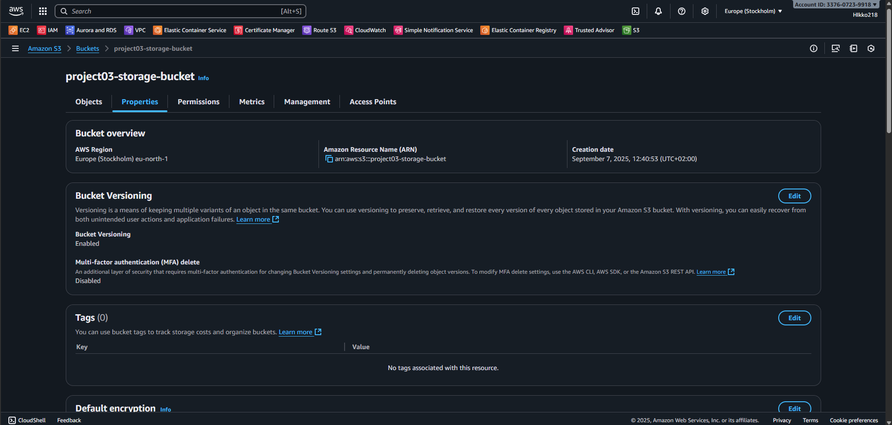
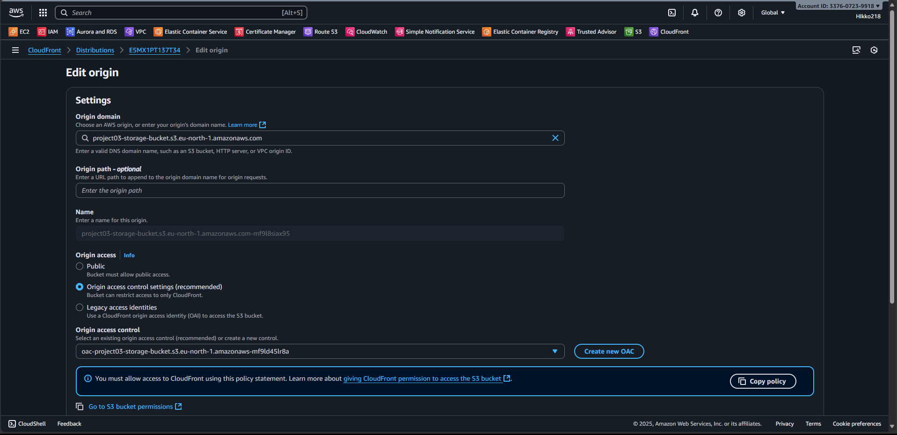
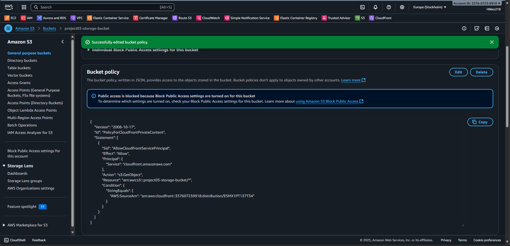
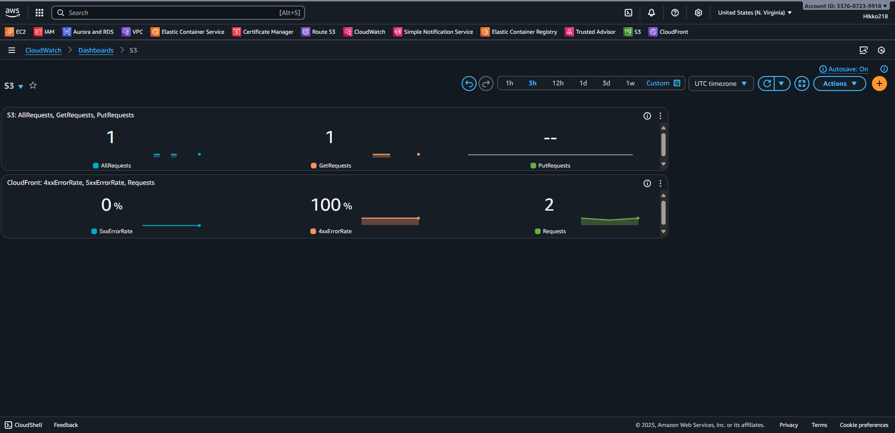
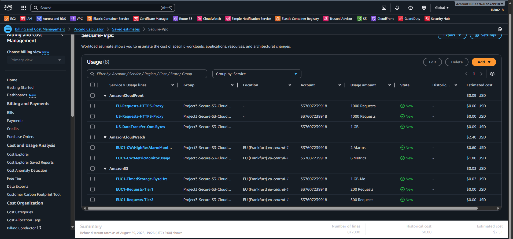

# Cloud Storage & Monitoring – Build Guide

## ⚙️ Step 1 – Create S3 Bucket

**S3 Lifecycle Rule**

**S3 Versioning**

---

## ⚙️ Step 2 – CloudFront
Set up a CloudFront distribution with restricted access to the S3 bucket using **Origin Access Control (OAC)**.

- Origin Domain: `project03-storage-bucket.s3.<region>.amazonaws.com`
- Origin Access: OAC 
- Viewer Protocol Policy: Redirect HTTP → HTTPS

**CloudFront Distribution**  

**S3 Policy**  

---

## ⚙️ Step 3 – Monitoring with CloudWatch

To monitor both **S3** and **CloudFront**, we created a custom CloudWatch Dashboard.  

### 🔹 S3 Metrics
- Enabled **Request Metrics** in the bucket.  
- Added widgets for:  
  - **AllRequests**  
  - **GetRequests**  
  - **PutRequests**  

📌 Note: **Storage Metrics** (e.g., `NumberOfObjects`, `BucketSizeBytes`) are also available, but they have up to 24h delay before showing data.

### 🔹 CloudFront Metrics
- CloudFront metrics are published to the **N. Virginia (us-east-1)** region, because CloudFront is a **global service**.  
- Added widgets for:  
  - **4xxErrorRate**  
  - **5xxErrorRate**  
  - **Requests**  

📸 **Screenshot: CloudWatch Dashboard with S3 and CloudFront Metrics**  

---

## ⚙️ Step 4 – Threat Detection (GuardDuty + Security Hub)

### 🔹 GuardDuty
- Enabled **Amazon GuardDuty** for the account.  
- GuardDuty continuously analyzes:  
  - **VPC Flow Logs**  
  - **DNS Logs**  
  - **CloudTrail Events**  
  - (Optional) S3 Data Events, EKS Audit Logs  

- Findings are shown in the GuardDuty console, categorized by severity (Low, Medium, High).  

📸 **Screenshot: GuardDuty Findings Dashboard**  

### 🔹 Security Hub (optional)
- Security Hub can be enabled to **aggregate findings** from multiple services (GuardDuty, AWS Config, Inspector).  
- In this setup, Security Hub would show the same findings as GuardDuty, so GuardDuty alone is sufficient for the demo.  

With GuardDuty enabled, we have **automated threat detection** integrated into our storage & monitoring environment. 

---

## ⚙️ Step 5 – Cost Estimation & Cleanup

To understand the monthly running costs, the **AWS Pricing Calculator** was used.  
We included **Amazon S3, CloudFront, and CloudWatch** based on realistic low-usage settings for a demo environment.  

📸 **Screenshot: Pricing Calculator – Cloud Storage & Monitoring**  

### 🔹 Estimated Monthly Costs
- **Amazon S3**: ~$0.05 (1 GB storage, ~700 requests/month)  
- **Amazon CloudFront**: ~$0.10 (1 GB data transfer, 2000 requests)  
- **Amazon CloudWatch**: ~$2.40 (6 metrics + 2 alarms)  
- **GuardDuty**: free for first 30 days, then charged per log volume analyzed (omitted in estimate)  

**Total Estimated Monthly Cost: ~$2.51**  

---

✅ With this setup, the project demonstrates not only **architecture and security**, but also **cost-awareness** — a crucial aspect of real-world cloud engineering.

